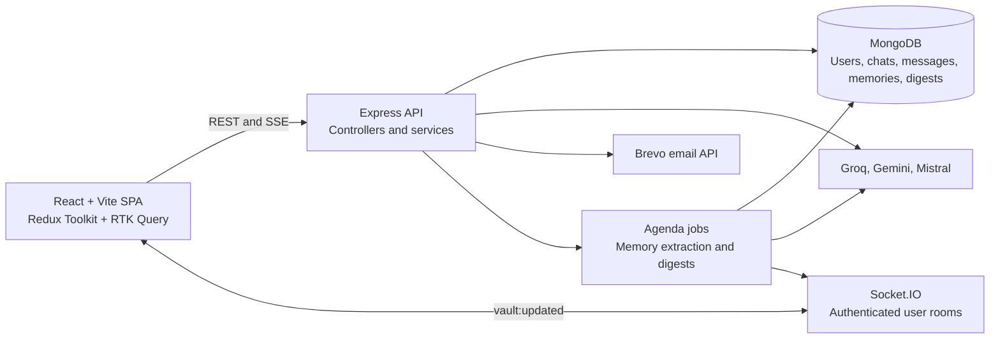

# MindVault
Your personal AI memory vault for conversations, notes, and recurring knowledge.

## Overview

MindVault is a full-stack MERN application that turns AI conversations and quick notes into persistent, structured memories. Users can chat in category-scoped workspaces, browse and manage a personal vault, search memories, and review periodic AI-generated digests.

When a chat is closed, an Agenda job can send the conversation to Gemini for memory extraction. Extracted memories are validated, optionally embedded, compared with existing memories, and saved to MongoDB. New chats can receive recent memories as context before the AI response is generated.

The repository contains two independently runnable applications:

- `Frontend`: React/Vite single-page application.
- `Backend`: Express API, Socket.IO server, MongoDB access, AI integrations, and background jobs. It can also serve the built frontend from `Backend/public`.

## Features

- Email-based signup, verification, login, refresh, logout, and password reset flows.
- Category-scoped chats for `coding`, `deen`, `admin`, `life`, and `global`.
- AI chat responses through Groq, with optional SSE response delivery.
- Automatically generated chat titles through Mistral.
- Context injection from recent vault memories when starting a chat.
- Memory vault with pagination, category/type filters, editing, archiving, and deletion.
- Quick Capture modal, opened globally with `Ctrl+Shift+M` or `Cmd+Shift+M`.
- Gemini classification of quick captures into category, type, and tags.
- Keyword search and optional semantic search using Gemini embeddings and in-process cosine similarity.
- Duplicate detection that can reinforce an existing memory or flag a possible duplicate.
- Background memory extraction after a chat is closed when the minimum user-message count is met.
- Weekly digest generation from recent memories and chat activity.
- Socket.IO notifications when newly extracted memories update the vault.
- Dashboard views for memory category counts, recent memories, and recent chats.

## Tech Stack

### Frontend

- React 19
- Vite 6
- React Router 7
- Tailwind CSS 4
- Lucide React
- React Markdown with GitHub-Flavored Markdown support

### Backend

- Node.js with ES modules
- Express 5
- Socket.IO
- Axios
- Winston and Morgan logging
- Express Rate Limit

### Database and Jobs

- MongoDB with Mongoose
- Agenda.js using MongoDB for scheduled jobs
- Collections represented by `User`, `Chat`, `Message`, `Memory`, and `Digest` models

### AI and Email Integrations

- Groq `llama-3.3-70b-versatile` for chat responses and digest generation
- Google Gemini `gemini-2.5-flash-lite` for extraction and classification
- Google Gemini `embedding-001` for memory embeddings
- Mistral `mistral-small-latest` for chat titles
- Brevo SMTP API for verification and password-reset email delivery

### State and Networking

- Redux Toolkit slices for auth, chat, vault, and capture state
- RTK Query for auth, vault, and digest APIs
- Axios services for chat operations and SSE consumption
- Socket.IO client for vault update events

## Architecture

The frontend and backend are separate during development. The backend owns HTTP routes, authentication, business services, database access, AI calls, and asynchronous jobs. Socket.IO is attached to the same HTTP server as Express.



Typical memory extraction flow:

1. The authenticated client emits `chat:closed` through Socket.IO.
2. The server checks `userMessageCount` against `EXTRACTION_MIN_MESSAGES` and schedules `extract-memories` with Agenda.
3. Gemini extracts structured memory nodes from the conversation.
4. Valid nodes are embedded and compared with the user's active memories using cosine similarity.
5. New memories are stored, duplicate memories may be reinforced, and the user's memory summary is updated.
6. The server emits `vault:updated` to the user's private Socket.IO room.

The SSE chat endpoint currently generates the complete Groq response first, then sends whitespace-delimited chunks with a short delay. It provides progressive rendering in the UI, but it is not provider-level token streaming.

## Project Structure

```text
MindVault/
├── Backend/
│   ├── server.js                 # HTTP server, Socket.IO, MongoDB, and Agenda startup
│   ├── package.json              # Backend scripts and dependencies
│   ├── public/                   # Static frontend build served by Express
│   └── src/
│       ├── app.js                # Express middleware, CORS, limits, routes, static serving
│       ├── config/               # Environment, MongoDB, Agenda, and Gemini setup
│       ├── controllers/          # HTTP request handlers
│       ├── jobs/                 # Agenda job definitions
│       ├── middlewares/          # Auth, context injection, validation, and errors
│       ├── models/               # Mongoose schemas
│       ├── routes/               # Auth, chat, memory, and digest routes
│       ├── scripts/              # Migration and maintenance scripts
│       ├── services/             # Auth, chat, AI, search, extraction, digest, and email logic
│       ├── socket/               # Socket.IO authentication and event handlers
│       ├── utils/                # Prompts, logging, token counting, and similarity helpers
│       └── validators/           # Joi request schemas
├── Frontend/
│   ├── package.json              # Frontend scripts and dependencies
│   └── src/
│       ├── app/                  # Router, Redux store, root application
│       ├── features/             # Auth, chat, vault, capture, and digest features
│       ├── constants/            # Categories, memory types, and endpoint defaults
│       └── shared/               # Layout, UI components, hooks, and API re-auth logic
└── README.md
```

## Getting Started

### Prerequisites

- Node.js and npm
- A MongoDB deployment reachable by the backend
- API credentials for Groq, Gemini, and Mistral
- Brevo API credentials if using email verification or password reset

### Repository Setup

Clone the repository and open the project directory:

```powershell
git clone <repository-url>
cd MindVault
```

The repository has no root-level install or combined development script. Install dependencies in each application directory.

### Environment Setup

Create `Backend/.env.development` using `Backend/.env.example` as the template. The backend loads `.env.development` for `npm run dev` and `.env.production` for `npm start`, based on `NODE_ENV`.

For frontend development, optionally create `Frontend/.env` with the Vite variables documented below. The defaults point to the local backend.

### Install Dependencies

```powershell
cd Backend
npm install

cd ..\Frontend
npm install
```

### Run in Development

Start the backend in one terminal:

```powershell
cd Backend
npm run dev
```

Start the Vite frontend in another terminal:

```powershell
cd Frontend
npm run dev
```

The backend defaults to `http://localhost:3000`. Vite uses its standard development port unless configured otherwise, normally `http://localhost:5173`.

### Production Commands

Backend:

```powershell
cd Backend
npm start
```

Frontend build and preview:

```powershell
cd Frontend
npm run build
npm run preview
```

Frontend linting:

```powershell
cd Frontend
npm run lint
```

## Environment Variables

Use placeholders for all secrets. Do not commit environment files containing credentials.

### Backend

| Variable | Purpose |
|---|---|
| `NODE_ENV` | Selects `.env.development` or `.env.production`. |
| `PORT` | HTTP server port. |
| `CLIENT_URL` | Allowed browser origin for CORS and email redirects. |
| `SERVER_URL` | Public backend URL used in verification email links. |
| `DB_URI` | Mongoose MongoDB connection string. |
| `MONGODB_URI` | MongoDB connection string used by Agenda; falls back to `DB_URI`. |
| `JWT_SECRET` | Signs access and email-verification JWTs. |
| `JWT_REFRESH_SECRET` | Signs refresh JWTs. |
| `SENDER_EMAIL` | Sender address for Brevo email messages. |
| `BREVO_API_KEY` | Brevo API credential. |
| `GEMINI_API_KEY` | Gemini extraction, classification, and embedding credential. |
| `GROQ_API_KEY` | Groq chat and digest credential. |
| `MISTRAL_API_KEY` | Mistral chat-title credential. |
| `EXTRACTION_MIN_MESSAGES` | Minimum user messages required before extraction is scheduled. |
| `EXTRACTION_INACTIVITY_MINUTES` | Present in the template; current close-event logic does not use it. |
| `EXTRACTION_DELAY_MINUTES` | Agenda delay after `chat:closed`; `0` runs immediately. |
| `CONTEXT_MAX_MEMORIES` | Maximum memories selected for context. |
| `CONTEXT_MAX_TOKENS` | Approximate context token budget. |
| `SIMILARITY_MERGE_THRESHOLD` | Similarity score at which a memory reinforces an existing memory. |
| `SIMILARITY_WARN_THRESHOLD` | Similarity score at which a possible duplicate is flagged. |
| `AGENDA_COLLECTION` | MongoDB collection used for Agenda jobs. |
| `AGENDA_PROCESS_EVERY` | Agenda polling interval. |
| `AGENDA_MAX_CONCURRENCY` | Maximum concurrent Agenda jobs. |
| `VITE_ENABLE_SEMANTIC_SEARCH` | Backend feature flag for `/memories/search`; `true` selects semantic search. |
| `VITE_ENABLE_CONTEXT_PILLS` | Present in the template; inspect frontend behavior before enabling or relying on it. |

### Frontend

| Variable | Default | Purpose |
|---|---|---|
| `VITE_API_URL` | `http://localhost:3000/api` | Backend API base URL. |
| `VITE_SOCKET_URL` | `http://localhost:3000` | Socket.IO server URL. |

## API Documentation

All backend routes are prefixed with `/api`. Protected routes require an access token in `Authorization: Bearer <token>`; the backend also accepts a `token` cookie for protected HTTP requests.

### Authentication

| Method | Route | Auth | Purpose and request |
|---|---|---|---|
| `POST` | `/auth/signup` | Public | Body: `name`, `email`, `password`, `confirmPassword`. Creates an unverified account and sends a verification email. |
| `POST` | `/auth/login` | Public | Body: `email`, `password`. Returns an access token and user data; sets an HttpOnly refresh cookie. |
| `POST` | `/auth/refresh` | Public with cookie | Uses the `refreshToken` cookie and returns a new access token. |
| `GET` | `/auth/verify-email?token=...` | Public | Verifies the email and redirects to the configured client URL. |
| `POST` | `/auth/resend-verification` | Public | Body: `email`. Sends another verification email for an unverified account. |
| `POST` | `/auth/forgot-password` | Public | Body: `email`. Sends a reset link when the account exists and returns a non-enumerating response. |
| `POST` | `/auth/reset-password` | Public | Body: `token`, `newPassword`. Resets the password when the token is valid. |
| `GET` | `/auth/me` | Protected | Returns the current user. |
| `POST` | `/auth/logout` | Protected | Revokes the current refresh token and clears cookies. |

### Chats

| Method | Route | Auth | Purpose and request |
|---|---|---|---|
| `POST` | `/chats` | Protected | Body: `category`, `initialMessage`. Creates a chat, generates its initial AI response, and returns the chat plus injected memories. |
| `GET` | `/chats` | Protected | Lists the user's chats, sorted by latest activity. |
| `GET` | `/chats/:id` | Protected | Returns a user's chat with messages and populated injected memories. |
| `GET` | `/chats/:id/messages?page=1&limit=20` | Protected | Returns paginated chronological messages plus `hasMore` and `total`. Without pagination parameters, returns the full message array for compatibility. |
| `POST` | `/chats/:id/messages` | Protected | Body: `content`. Saves the user message, generates and saves an AI response, and returns the assistant message plus injected memories. |
| `POST` | `/chats/:id/messages/stream` | Protected | Body: `content`. Returns an SSE stream of response chunks and a final `done` event containing the saved assistant message. |
| `DELETE` | `/chats/:id` | Protected | Deletes the chat and its associated messages. |

### Memories

| Method | Route | Auth | Purpose and request |
|---|---|---|---|
| `GET` | `/memories?category=&type=&isArchived=&page=1&limit=20` | Protected | Lists filtered, paginated non-archived memories by default. |
| `POST` | `/memories/capture` | Protected | Body requires `content`; without `category`, returns Gemini classification. With `category`, creates a memory or returns a merge result. |
| `GET` | `/memories/search?q=&category=&type=` | Protected | Uses keyword search by default, or semantic search when `VITE_ENABLE_SEMANTIC_SEARCH=true`. |
| `GET` | `/memories/semantic?q=&category=&type=` | Protected | Always performs embedding-based semantic search. |
| `GET` | `/memories/stats` | Protected | Returns active memory counts for `coding`, `deen`, `admin`, and `life`. |
| `GET` | `/memories/:id` | Protected | Returns one memory owned by the current user. |
| `PATCH` | `/memories/:id` | Protected | Updates supported memory fields such as content, category, type, tags, and duplicate metadata. |
| `PATCH` | `/memories/:id/archive` | Protected | Toggles archive state. |
| `DELETE` | `/memories/:id` | Protected | Requires body `{ "confirm": true }` before hard deletion. |

### Digests

| Method | Route | Auth | Purpose |
|---|---|---|---|
| `GET` | `/digest/latest` | Protected | Returns the latest digest and marks it as read. |
| `GET` | `/digest` | Protected | Returns the user's digest archive. |
| `PATCH` | `/digest/:id/dismiss` | Protected | Marks a digest dismissed and read. |

### Socket.IO Events

- Client to server: `chat:closed` with `{ chatId }` to request extraction scheduling.
- Server to client: `vault:updated` with a count and short previews of newly created memories.
- Socket connections require a valid JWT supplied through handshake auth, query data, or the `token` cookie.

## Authentication

Login returns a short-lived access JWT that the frontend keeps in Redux state and sends as a Bearer token. The server also creates a 30-day refresh JWT in an HttpOnly, `SameSite=Strict` cookie. Refresh tokens are stored on the user document and checked against that allow-list before issuing a new access token.

The frontend retries failed authenticated requests through `/api/auth/refresh`. If refresh fails, it clears the auth state. Logout removes the refresh token from the user document and clears the relevant cookies.

## Engineering Highlights

- **Layered backend:** Express routes delegate to controllers, services contain business logic, and Mongoose models define persistence boundaries.
- **Asynchronous intelligence:** Agenda keeps extraction and digest work out of the request path. Extraction records status and attempts, and retries failed jobs up to three times.
- **Memory quality controls:** Extracted nodes are checked against allowed categories, types, confidence values, and content length before persistence. Embeddings support in-process cosine similarity for reinforcement and duplicate warnings.
- **User-scoped data access:** Chat and memory queries include the authenticated user ID, and Socket.IO clients join private `user:<id>` rooms.
- **Resilient context injection:** Context lookup failures are logged and do not prevent chat creation. Context selection is bounded by memory count and an approximate token budget.
- **Frontend state boundaries:** Redux slices hold UI/session state, while RTK Query manages cached server data for auth, memories, and digests. Chat-specific Axios code handles pagination and SSE consumption.
- **Progressive chat UX:** The frontend supports optimistic message presentation, paginated history, upward loading, Markdown rendering, and Socket.IO vault refresh notifications.

## Error Handling and Validation

- Joi schemas validate request bodies and route parameters; unknown body fields are stripped and validation errors return structured field messages.
- `express.json` limits request bodies to 50 KB.
- Async controllers use `asyncHandler` and centralized error handling.
- The error handler maps validation, cast, JWT, payload-size, and HTTP errors to appropriate status codes and avoids returning stack traces to clients.
- AI classification and embedding-dependent flows have fallbacks: classification returns a default `life`/`fact` result, and memory capture can save without an embedding if embedding generation fails.

## Security Considerations

Implemented controls include:

- Bcrypt password hashing with a salt factor of 10.
- Short-lived access tokens and HttpOnly refresh-token cookies.
- `SameSite=Strict` cookies and secure cookies in production.
- Refresh-token allow-listing and revocation on logout.
- CORS restricted to `CLIENT_URL` with credentials enabled.
- Rate limits on signup, login, and forgot-password routes.
- User ownership checks on chat and memory queries.
- Joi validation and payload-size limits.
- Non-enumerating forgot-password response.

Environment files should remain outside version control. If any real credentials have been used in a local environment file, rotate them before sharing or deploying the repository.

## Screenshots / Demo

No screenshot assets, live demo URL, or video link are included in the repository.

## Future Improvements

Potential improvements based on the current implementation:

- Add automated backend and frontend tests for authentication, extraction thresholds, pagination, and ownership boundaries.
- Replace simulated SSE chunking with provider-level streaming from the chat model.
- Move semantic retrieval and context ranking to a dedicated vector index as the vault grows.
- Add a single root-level development command and deployment documentation for the frontend build in `Backend/public`.
- Add an OpenAPI specification or generated API reference to complement the route summary above.

## License

No root-level `LICENSE` file is present. The backend package declares the ISC license in `Backend/package.json`.